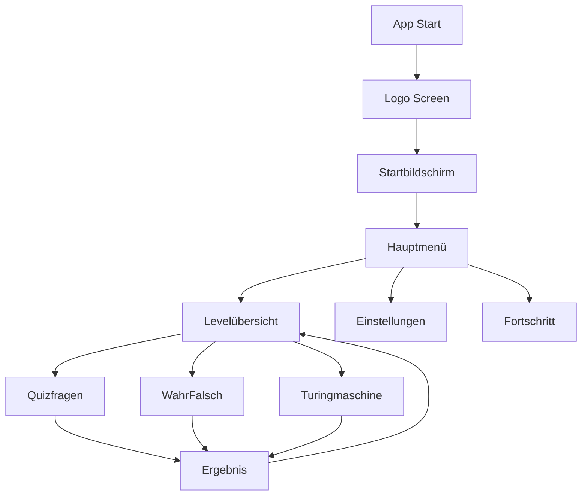

# App Ablauf Diagramm  
  
</> Markdown
graph TD  
  
# App Ablauf Diagramm  

  

```mermaid  
graph TD  
  
Start[App Start] --> Logo[Logo Screen]  
Logo --> Startbildschirm  
Startbildschirm --> Hauptmenü  
  
Hauptmenü --> Levelübersicht  
Hauptmenü --> Einstellungen  
Hauptmenü --> Fortschritt  
  
Levelübersicht --> Quizfragen  
Levelübersicht --> WahrFalsch  
Levelübersicht --> Turingmaschine  
  
Quizfragen --> Ergebnis  
WahrFalsch --> Ergebnis  
Turingmaschine --> Ergebnis  
  
Ergebnis --> Levelübersicht  
```
